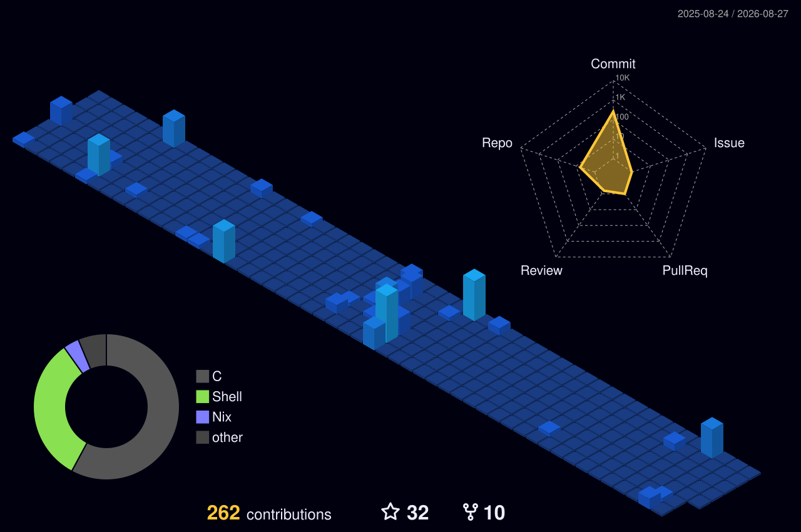

### 关于我 / About Me

> **hi 这里是sonako.**  
> 一个热爱 linux 和中度依赖 terminal 的小白，欢迎您来到我的主页。  
>
> **hi This is sonako,**  
> a novice who loves Linux and is moderately dependent on terminal. Welcome to my homepage.

- **主要方向 / Focus:** Android Kernel 开发与移植
- **主力系统 / OS:** NixOS & Windows
- **编辑器偏好 / Editor:** Neovim / VS Code 

---

<div align="center">
  
</div>

> **SYSTEM INFO**
```text
 OS: NixOS ❄️ (x86_64 / AArch64)
 Kernel: Linux 7.x (Custom Android/Mainline) 
 Editor: Neovim  / VS Code
 Focus: Kernel Development
 Shell: Fish + Starship
 Terminal: Kitty / Alacritty / WezTerm
```
---

### Tech Stack & Tools

#### System & Env


#### Edites & Tools


#### Code


---

<div align="center">
  
</div>

<div align="center">

  
  
  

</div>

<div align="center">  </div>

---

<div align="center">
  <sub>NixOS & Neovim by Yosaki-sonako</sub>
</div>
